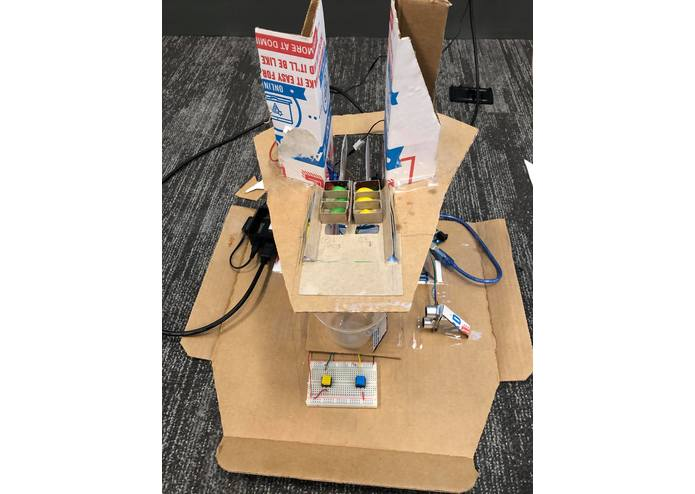
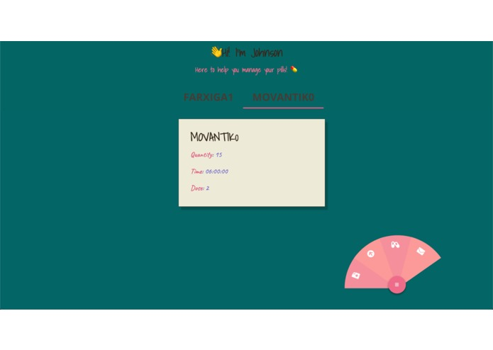

# IoT Automatic Pill Dispenser

This project was an autmatic IoT pill dispenser robot for BostonHacks 2019. Winner of Best Digital Health Hack.

## How it works

A schedule is input into the front end web-app. This will containt all the information needed (which pill, number of pills,and when to dispense them). This will communicate to the back-end which adds the schedule into a database. Once it is time to take the pills, the back-end sends an MQTT message to a RaspberryPi that it is time to dispense some pills. The RaspberryPi communicates through a serial UART connect to an Arduino Uno to move the appropriate servo the correct amount to dispense the pills into a container. Once the pills are dispensed, the Arduino uses an ultrasonic sensor to detect if the pill container has been picked up (and hopefully taken). Once the pills are taken, the RaspberryPi will send an MQTT message back to the back-end alerting the system that the pills have been taken. Once there pill cartridge is empty, a button can be pressed to reset the servos and the pills can be refilled.

In order to dispense the correct amount of pills, an egg-shaped cardboard piece is attached to the shaft of a servo. When the servo is turned, pills are pushed out. Every 30 degree turn results in one pill being dispensed. Unfortunately, with this setup, only 3 pills can be dispensed at a time. This is because we did not have more the parts necessary to make a more robust pill dispensing system given that it was only a 24 hour hack.

## Limitations and improvements

Right now, the robot can only dispense three pills before needing to be refilled. This is not very practical so instead we would have a sort of linear actuator to push pills out one by one. A linear actuator can be made by a toothed rod and a DC motor with a gear on the shaft to push the stick forward.

In addition, there is no system in place to automatically remind users to take their pills. We could use Twillio to send text reminders to the patients to take their pills, or have an alarm which goes off when it is time to take their pills. We could also use Twillio to alert the nurses or the patients or the family members whether or not the pills have been taken.
